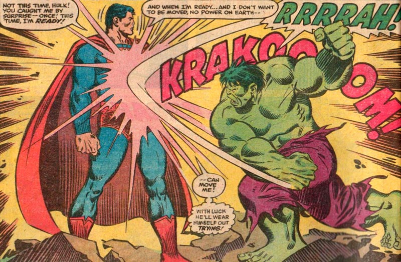
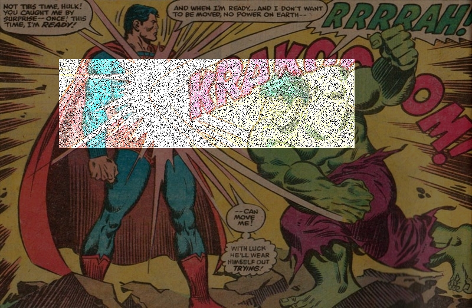
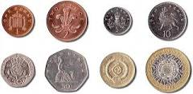
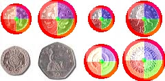

# ImageProcessing

**Task list [wiki]** for whenever I get back to this.  Last update December 2017.

## PixelIntensity

Experiments in altering pixel intensity of images. ```PixelIntensityBW.C ``` changes intensity in gray scale images. PixelIntensityBW.C takes two parameters, contrast and brightness, and adjusts these values in color images. The sample results show a high-lighted region using specific contrast and brightness values. Additionally, there has been some noise applied in the high-lighted region. The rest of the image outside the region has lowered intensity.

### Sample results
| **Original** | **Salt-and-Pepper Noise** |
|--------------|---------------------------|
|||

## FlatCoinDetection

Using Hough Transform to detect circular coins in an image, ```CoinDetection.C ```. The sample shows how the coin circumferences and centers are high-lighted. Additionally using pixel RBG brightness to high-light each quarter of the coins.

### Sample results
| **Original** | **Flat Coin detection** |
|--------------|-------------------------|
|||

[wiki]: https://github.com/oldoak/ImageProcessing/wiki
